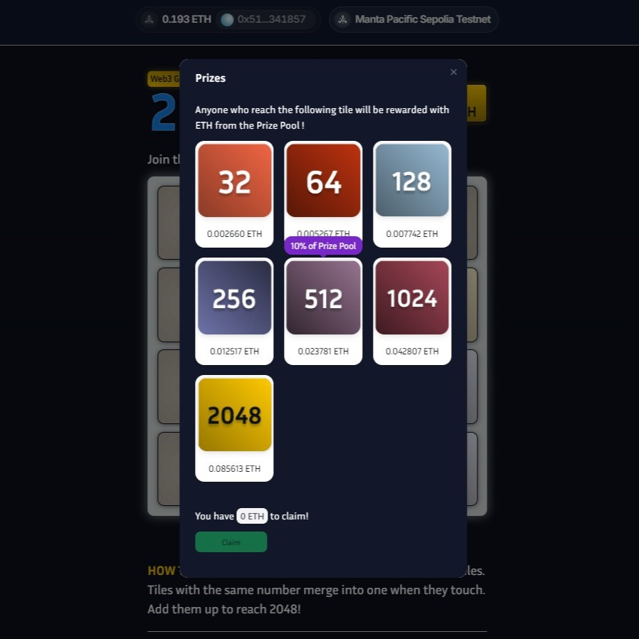
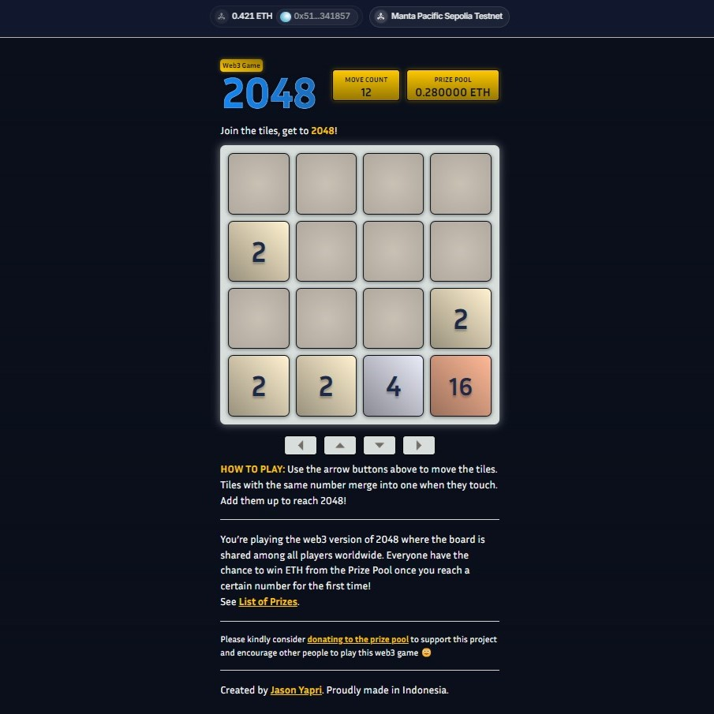
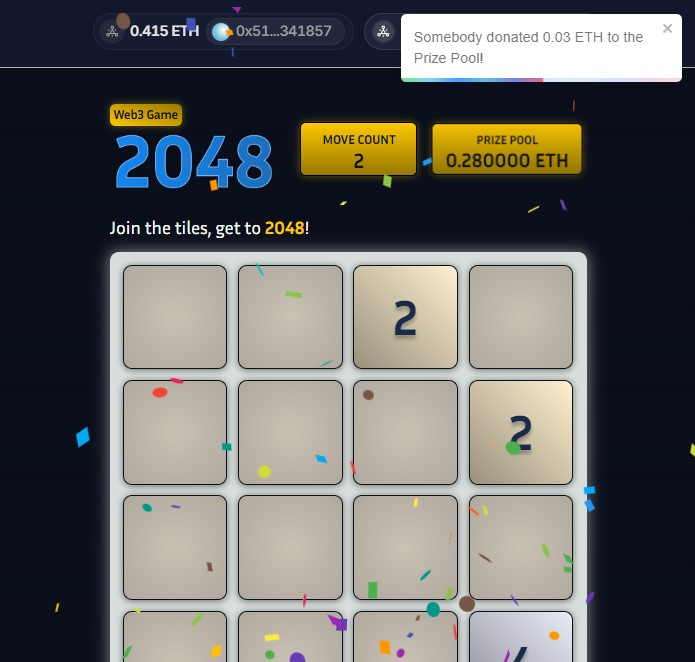
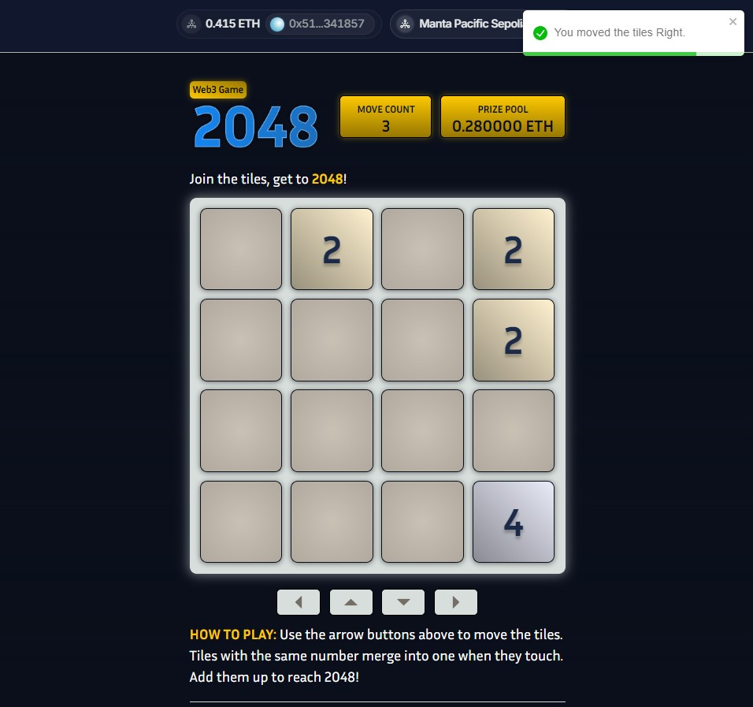
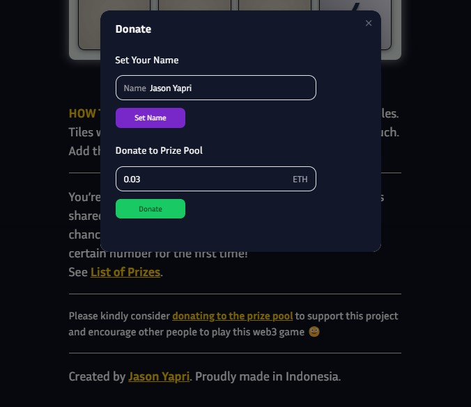

## Introduction

<a href="https://2048.jasonyapri.com" target="_blank"></a>&nbsp;&nbsp;
<a href="https://2048.jasonyapri.com" target="_blank"></a>&nbsp;&nbsp;
<a href="https://2048.jasonyapri.com" target="_blank"></a>&nbsp;&nbsp;
<a href="https://2048.jasonyapri.com" target="_blank"></a>&nbsp;&nbsp;
<a href="https://2048.jasonyapri.com" target="_blank"></a>

<p>Web3 Implementation of the 2048 Game running on Manta Pacific Sepolia Testnet.</p>
<p>The board is shared among all players worldwide. Everyone have the chance to win ETH from the Prize Pool once you reach a certain number for the first time! <i>(Currently it's only optimized for desktop browser with browser wallet like Metamask)</i></p>
👉 <a href="https://2048.jasonyapri.com">Try it now</a> 👈

## Getting Started

### Smart Contract

```
forge test -vv

forge script script/Web3Game2048.s.sol:Web3Game2048Script --broadcast --verify
```

1. Run the test to make sure it all passed
2. Create `.env` file based on `.env.sample`
3. Deploy the solidity smart contract using the script

### Frontend

First, open frontend folder and run the development server:

```bash
cd frontend

Setup `.env` from `.env.sample`

npm run dev

npm run build

npm run start
```

Open [http://localhost:3000](http://localhost:3000) with your browser to see the result.

## Author

Name: Jason Yapri

Website: https://jasonyapri.com

LinkedIn: https://linkedin.com/in/jasonyapri/
